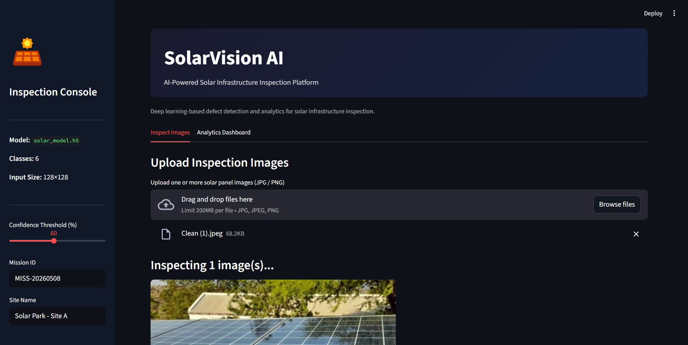
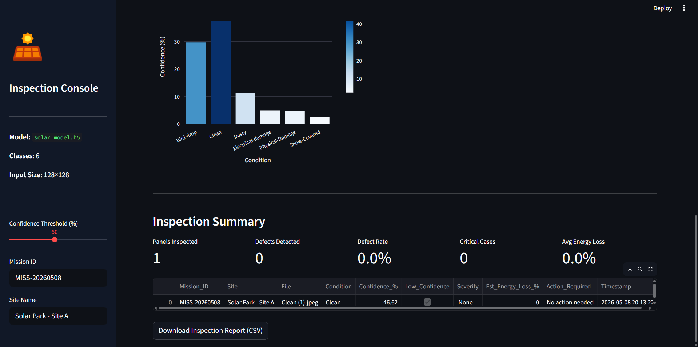
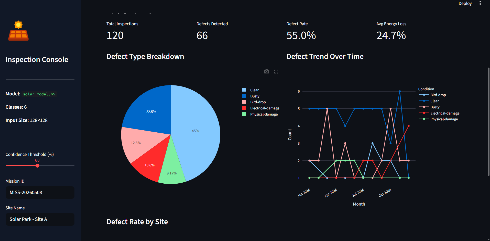

# SolarVision AI

AI-powered solar panel defect detection and inspection platform using deep learning and drone imagery.

## Features
- Multi-class solar defect classification
- Real-time image inspection
- Confidence-based prediction validation
- Inspection analytics dashboard
- CSV inspection report generation
- MobileNetV2 transfer learning

## Defect Classes
- Clean
- Dusty
- Bird-drop
- Electrical-damage
- Physical-Damage
- Snow-Covered

## Tech Stack
- Python
- TensorFlow / Keras
- Streamlit
- Plotly
- Computer Vision

## Model
The model uses MobileNetV2 transfer learning trained on 876+ solar panel images.

## Run Locally

```bash
pip install -r requirements.txt
streamlit run app.py
```

## screenshots








## Future Improvements
- Real-time drone feed integration
- YOLO-based defect localization
- Thermal imaging support
- Cloud deployment

# SolarVision-AI

